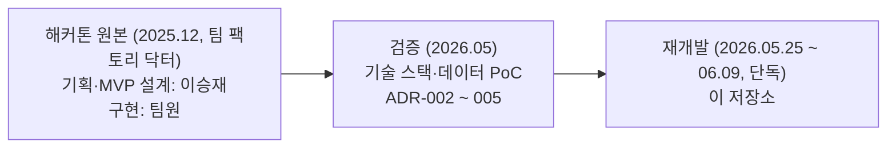
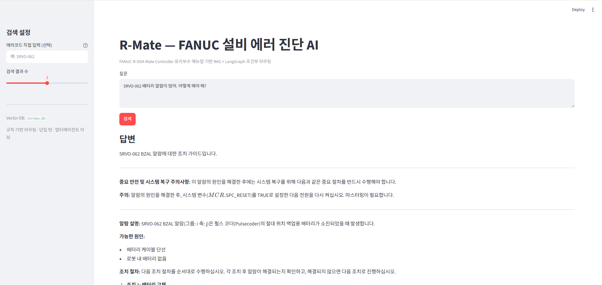
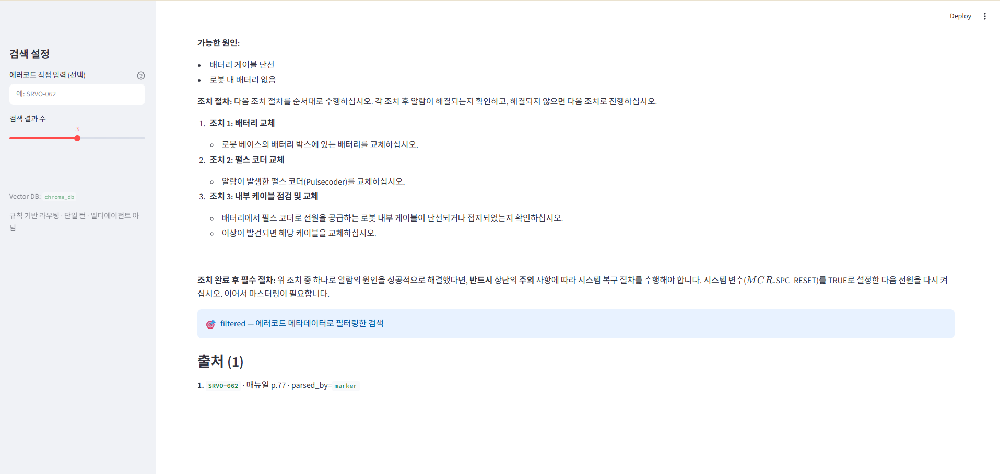

# R-Mate - FANUC 설비 에러 진단 AI 에이전트

> FANUC R-30iA Mate Controller 유지보수 매뉴얼 기반 RAG + LangGraph 상태 머신으로 설비 알람을 진단하고 한국어 수리 가이드를 생성하는 에이전트.

작업자가 알람 코드(예: `SRVO-062`)나 증상을 자연어로 질의하면 매뉴얼 근거를 검색해 **안전 주의사항을 우선한 한국어 조치 가이드**를 출처와 함께 생성.

---

## 개발 계보

스마트 제조 AI Agent 해커톤 2025(주최 DACON) 본선 결과물의 개념을 계승해 기술 스택과 데이터를 검증한 뒤 처음부터 다시 구현. 원본 코드 미반입.



| 구분 | 해커톤 원본 | 재개발 (이 저장소) |
|---|---|---|
| 저장소 | [factory_doctor-fanuc_agent](https://github.com/YuYeongChan/factory_doctor-fanuc_agent) (팀원 계정) | 이 저장소 |
| 담당 | 기획 · FANUC 도메인 한정 · MVP 기획서 리드. 구현은 팀원 주도 | 기획 재정의부터 구현 · 테스트까지 단독 |
| 청킹 | 정규식 `SRVO-xxx` 블록 분리, 일부 페이지 | `(Explanation)`/`(Action)` 마커 기반 1코드 1청크, 261p 전체 → 93청크 |
| 임베딩 | `all-MiniLM-L6-v2` 384d (로컬) | `gemini-embedding-001` 768d |
| 벡터 DB | PostgreSQL + pgvector | Chroma (로컬 파일) |
| 오케스트레이션 | FastAPI `/diagnose` 단일 경로 | LangGraph 조건부 라우팅 + 1회 재시도 |
| 검증 | 없음 | PoC 선행, 통과분만 구현. 테스트 63개 |

원본 기획의 핵심 차별점이던 Cross-Reference RAG 는 재개발 검증에서 근거 희소(261p 중 `See Section` 3회)로 기각하고 기능을 재정의([ADR-002](docs/decisions/ADR-002-cross-reference-rag-redefinition.md)). 임베딩·LLM 은 기획서 내 불일치(Solar 대 OpenAI)를 해소하며 Gemini 단일 스택으로 전환([ADR-003](docs/decisions/ADR-003-llm-embedding-gemini.md)), 벡터 DB 는 청크 규모(약 100개)에 맞춰 pgvector 에서 Chroma 로 교체([ADR-004](docs/decisions/ADR-004-vector-db-chroma.md)).

해커톤 증빙은 원본 저장소의 예선 기획서 · 본선 진출 인증서 · [시연 영상](https://youtu.be/zN9MBUtZLR4) 참조.

---

## 데모

Streamlit 데모 UI(`app.py`)에 알람 코드나 증상을 입력하면 매뉴얼 근거로 한국어 조치 가이드 생성.



조치 절차와 함께 검색 모드(`filtered`) · 출처(에러코드 · 매뉴얼 페이지 · 파싱 방식) 표기.



---

## 주요 특징 (검증된 것만)

- **구조화 청킹**: PDF 에서 `(Explanation)`/`(Action)` 마커를 기준으로 SRVO 1코드 = 1청크 분할. 261페이지 실측에서 마커 일관성 약 80%(`(Explanation)` 79.6%, `(Action)` 81.6%) 확인 후 채택([ADR-002](docs/decisions/ADR-002-cross-reference-rag-redefinition.md)). 결과 261p → 93청크
- **벡터 검색**: `gemini-embedding-001`(768d) 임베딩과 Chroma 로컬 벡터 DB. 93청크 인덱싱 완료, 에러코드 · 페이지 메타데이터 동반 저장으로 필터 검색 지원
- **LangGraph 조건부 라우팅**: 질의에서 에러코드를 정규식으로 감지해 코드가 있으면 메타데이터 필터 검색, 없으면 일반 검색. 필터 검색 0건이면 필터를 풀고 1회 재시도(bounded retry), 그래도 0건이면 LLM 호출 없이 조기 종료([설계](docs/langgraph-multiagent.md), [ADR-005](docs/decisions/ADR-005-langgraph-orchestration.md))
- **LLM 답변**: `gemini-2.5-flash` 로 매뉴얼 발췌에 근거한 한국어 안전 우선 수리 가이드 생성. 출처(error_code · page · 검색 모드) 동반 반환
- **테스트**: 단위 · 통합 63개 통과. 각 그래프 노드는 의존성 주입으로 독립 테스트

---

## 기술 스택

| 영역 | 사용 기술 |
|---|---|
| 언어 | Python 3.12 |
| 그래프 오케스트레이션 | LangGraph (`StateGraph`, 조건부 라우팅) |
| LLM · 임베딩 | google-genai (`gemini-2.5-flash`, `gemini-embedding-001`) |
| PDF 파싱 | pdfplumber |
| 벡터 DB | ChromaDB (로컬 파일 기반) |
| 데모 UI | Streamlit |
| 테스트 | pytest |

LLM · 임베딩 모델은 비용 · 속도 균형 기준의 잠정 선택이며 정량 비교(A6 잔여)는 후속 검증 대상.

---

## 프로젝트 구조

```
src/
├── parsing/    # PDF 로드·노이즈 제거 → 마커 기반 SRVO 청킹 → 메타데이터 태깅
├── index/      # Chunk 임베딩(gemini-embedding-001) + Chroma 적재 파이프라인
├── retrieval/  # 쿼리 임베딩 + Chroma 유사도 검색(에러코드 메타데이터 필터)
├── agent/      # LLM 답변 생성(gemini-2.5-flash, 안전 우선 프롬프트) + ask() 진입점
└── graph/      # LangGraph 조건부 라우팅 상태 머신(검색 → 답변 + 재시도)
```

검증 기록은 `docs/validation/`, 아키텍처 의사결정은 `docs/decisions/`(ADR), PoC 는 `experiments/`. 문서·표기 규약은 [`docs/conventions.md`](docs/conventions.md).

---

## 구현 노트

- **RAG 파이프라인**: 파싱(PDF → 청크) → 인덱싱(`gemini-embedding-001` 임베딩 + Chroma 적재) → 검색(쿼리 임베딩 + 에러코드 메타데이터 필터) → 답변 생성(`gemini-2.5-flash`). 재시도 · 조기 종료를 포함한 흐름을 LangGraph 상태 머신으로 구성하고 외부 진입점은 `ask()`(`src/agent/pipeline.py`) 하나로 고정
- **의존성 주입 + 테스트**: `ask()` 와 `build_graph()` 가 검색기(`Retriever`)와 LLM 클라이언트를 인자로 수신(`make_retrieve`/`make_answer` 클로저 팩토리로 노드에 주입). 실행 시 기본 객체 생성, 테스트 시 가짜 검색기 · 클라이언트를 주입해 Chroma · Gemini 호출 없이 노드별 검증. 라우팅 분기 같은 순수 함수는 단위 테스트로 검증해 합계 63개 구성
- **개발 원칙**: 기획서 가정 → `experiments/` PoC 검증 → 통과분만 `src/` 구현. 실패 시 `docs/validation/` 에 사유 · 대안 기록 후 기획 수정

---

## 실행 방법

### 1. 환경 설정

```bash
python -m venv .venv
.venv\Scriptsctivate          # Windows (bash: source .venv/Scripts/activate)
pip install -r requirements.txt
```

`.env` 파일 생성(`copy .env.example .env`) 후 아래 값 기입.

```
GOOGLE_API_KEY=<Google AI Studio 키>      # 임베딩·LLM 호출용
MANUAL_PDF_PATH=data/raw/R30iA-Mate-Controller-Maintenance-Manual.pdf
```

매뉴얼 PDF 는 저작권 문제로 저장소 미포함, `data/raw/` 에 직접 배치. 인덱싱은 임베딩 API 를 다량 호출하므로 무료 티어 일일 쿼터 초과 가능(유료 티어 권장).

### 2. 인덱싱 (PDF → 파싱 → 임베딩 → Chroma 적재)

```python
import sys; sys.path.insert(0, "src")
from index.pipeline import run_indexing

run_indexing(persist_dir="chroma_db")   # .env의 MANUAL_PDF_PATH 사용
```

### 3. 질의 (검색 → 한국어 수리 가이드 생성)

```python
import sys; sys.path.insert(0, "src")
from agent.pipeline import ask

result = ask("SRVO-062 배터리 알람이 떴어. 어떻게 해야 해?")
print(result["answer"])           # 한국어 안전 우선 수리 가이드
print(result["retrieval_mode"])   # filtered | unfiltered | unfiltered_fallback | none
print(result["sources"])          # [{error_code, page_no, parsed_by}, ...]
```

### 4. 데모 UI · 테스트

```bash
streamlit run app.py
pytest tests/ -v
```

---

## 측정 결과

실측한 수치만 기재. 상세 기록은 `docs/validation/`.

- **라우팅 정확도**: 25질의 클린 테스트셋에서 25/25 가 설계 의도대로 분기([검증 기록](docs/validation/A6-routing-quality-eval.md)). 라우팅은 규칙 기반 · 결정적이므로 정상 입력에서의 분기 동작을 뜻하며 변형 입력 견고성과는 별개
- **변형 입력 견고성**: 9케이스 측정 중 소문자 입력 버그 발견 · 수정(`CODE_RE` 에 `IGNORECASE` + 하이픈 선택 + 정규화)으로 7/9 → 9/9([검증 기록 §7](docs/validation/A6-routing-quality-eval.md))

---

## 한계

- 단일 턴 · 무상태의 규칙 기반 조건부 라우팅. LLM 이 라우팅을 판단하지 않으며(정규식 + 0건 판정) 자율 에이전트나 멀티에이전트가 아님
- 답변 품질 정량 평가, 검색 정확도(올바른 청크 회수), LLM · 임베딩 모델 비교(A6 잔여) 미측정. 정량 수치는 측정 후에만 기재
- Docker · CI · 배포 구성 없음
- 오타 교정 · 별칭(`BZAL` → 코드) 매핑 미구현(의도된 안전 폴백). 비필터 재시도(`unfiltered_fallback`)로 얻은 답변은 요청 코드와 다른 출처일 수 있어 `sources` 의 `error_code` 로 교차 확인 필요
